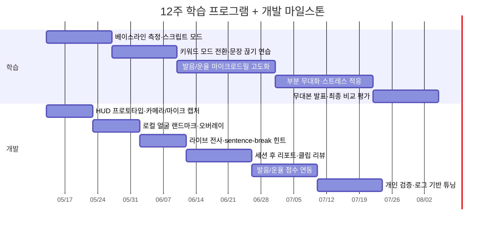
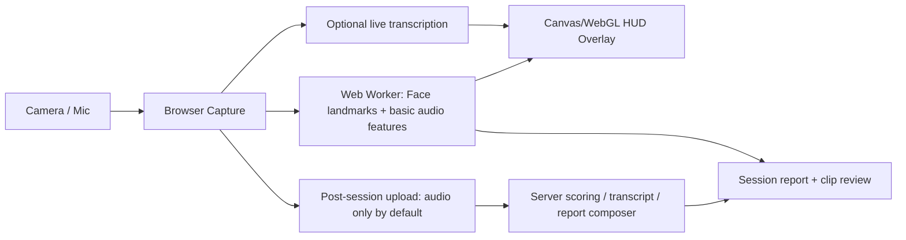

# HUD형 개인 영어 발표 코치 연구 보고서와 최종본

## Executive summary

가장 먼저 짚을 문제는 이것이다. “발표 중심 연습이 문장 단위 드릴보다 무조건 더 좋다”는 식의 직접 비교 근거는 아직 충분히 단단하지 않다. 과업기반 프로그램 전반의 상대효과에 대한 메타분석 자체가 정의와 연구설계 문제로 아직 불안정하다는 비판이 있고, 발표 활동의 효과를 보여주는 연구도 표본이 작은 경우가 많다. 그럼에도 현재 근거가 가리키는 방향은 분명하다. 발표·과업·반복 발표 같은 담화 단위 연습은 유창성, 응집성, 전달력, 자신감 같은 “실전 발표” 성과에 더 가깝고, CAPT·ASR·모바일 발음 훈련 같은 드릴형 훈련은 발음 정확도와 세부 음운 교정에는 중간 수준의 일관된 효과가 있지만 대개 listen-and-repeat, read-aloud 중심으로 설계되어 있고 전반적 intelligibility·comprehensibility를 덜 측정한다. 결론은 “발표 중심을 코어로 두고, 문제가 드러난 음운·운율만 짧은 마이크로 드릴로 보강하는 하이브리드”가 가장 타당하다는 것이다. citeturn10search0turn6view0turn7view1turn31view1turn32search0turn33search0

두 번째 문제는 실시간 피드백 욕심이다. HUD를 자비스처럼 많이 얹을수록 좋아질 것 같지만, 실시간 피드백은 숙련자에겐 유용해도 초보자나 긴장도가 높은 발표자에겐 인지 부하를 늘려 성능을 떨어뜨릴 수 있다. 언어학습 문맥에서는 즉시 피드백과 지연 피드백이 모두 효과를 보였고, 다른 수행 코칭 문맥에서는 사후 피드백이 초보자에게 더 잘 맞는 양상이 관찰되었다. HUD/AR-HUD 설계 연구도 일관되게 시각적 위계, 상황 적응형 정보 제시, 정보량 절제, 주의 유도와 오류 예방을 핵심 원칙으로 제시한다. 따라서 라이브 화면에는 “한 번에 하나의 핵심 힌트만” 주고, 중요한 분석은 세션 후 리포트로 넘기는 방식이 맞다. citeturn27view1turn28search0turn28search2turn27view4turn27view5

세 번째 문제는 “얼굴 인식”이라는 표현이다. 당신이 실제로 필요한 것은 신원 식별용 얼굴 인식이 아니라 얼굴 랜드마크·입술 블렌드셰이프·고개 안정성 추적이다. 브라우저에서 실시간 HUD를 만들려면 온디바이스 얼굴 랜드마크 추적이 훨씬 적절하고, 신원 인식은 기능적으로도 불필요하며 법적 리스크만 키운다. 브라우저 캡처는 HTTPS 보안 컨텍스트가 필요하고, 음성 평가 API를 쓰면 오디오와 기준 텍스트가 외부 서비스로 전송될 수 있으므로 기본값은 “로컬 처리 우선, 원본 영상 비저장, 오디오만 선택 업로드”가 맞다. citeturn23view3turn22view6turn22view9turn22view7turn22view8

현재 미지정 사항도 분명하다. 목표 영어 레벨, 기본 사용 기기(맥/윈도우/모바일), 클라우드 사용 허용 범위, 원본 영상 보관 여부, 1회 발표 길이, 평가에 사용할 외부 사람 수는 요청에서 명시되지 않았다. 아래 계획은 이 항목들을 “미지정”으로 두고도 바로 시작할 수 있게 설계했다.

## 무엇이 실제로 영어 발표를 빨리 늘리나

발표 중심 학습을 지지하는 근거는 존재하지만, 그 강도를 과장하면 안 된다. 2024년 quasi-experimental 연구에서는 발표 기반 활동이 fluency/coherence, lexical resources, grammar, pronunciation, engagement, interaction 전반을 끌어올렸고 자신감 향상도 시사했다. 반면 2023년 연구에서는 문제해결 과업의 interleaved repetition이 blocked repetition보다 L2 oral fluency 향상에 더 유리했다. 즉, “담화 단위로 말해 보는 것”과 “같은 유형의 말하기 과업을 반복하는 것”은 빠른 실전 향상에 도움이 된다. citeturn6view0turn11view1

하지만 문장 읽기·listen-and-repeat형 드릴을 버리라는 뜻은 아니다. CAPT에 대한 2025 systematic review는 30편의 연구를 검토해, 대부분이 성인 영어 학습자의 segmental feature에 집중했고 훈련 방식도 listen-and-repeat와 read-aloud가 지배적이었다고 정리했다. 2019년 CAPT 메타분석은 d = 0.68의 중간 효과를, 2022년 모바일 기반 발음학습 메타분석은 d = 0.66의 robust effect를 보고했다. 2024년 CAPT 메타분석도 overall medium effect를 보고하면서, 교실 내 사용과 영상 도구 활용에서 더 큰 효과 가능성을 제시했다. 이 패턴은 드릴이 쓸모없다는 뜻이 아니라, 드릴의 강점이 “정확도 보정”에 있고 “발표 운영 능력 전체”를 대체하지는 못한다는 뜻이다. citeturn31view1turn32search0turn33search0turn7view1

당신의 사용 시나리오에선 더더욱 발표 중심이 맞다. 당신이 스스로 가장 많이 성장한다고 느끼는 맥락이 PT 준비와 실제 발표이고, 실제 연구들도 발표 불안·자신감·비언어 전달이 성과를 좌우한다는 점을 반복해서 보여준다. 2025년 발표 불안 개입 메타분석은 외국어 말하기 불안 감소에 대해 중간 수준 효과를 보고했고, digital oratory 연구는 디지털 발표 불안에서 기술 요인보다 인지적·생리적 요인이 더 컸으며, 눈맞춤·제스처 점수가 voice control·facial expression보다 낮게 나왔다고 보고했다. 즉, 지금 풀어야 할 핵심 병목은 “문장 정확도 부족” 하나가 아니라 “호흡-자신감-리듬-표정-말 이어가기”다. citeturn6view5turn6view4turn11view3

그래서 가장 좋은 영어 학습 방식은 다음처럼 정리된다. 코어는 주 1회 발표형 실전 세션이다. 그 안에서 문제가 드러난 음소·강세·호흡·pause handling만 세션 후 5–10분짜리 드릴로 보정한다. 다시 말해 “발표가 주훈련, 드릴이 보조훈련”이다. 이 구조가 지금 당신 니즈와 현재 근거를 가장 잘 동시에 만족시킨다. citeturn6view0turn11view1turn31view1turn32search0turn33search0

| citation / year | method | sample | main finding | relevance |
|---|---|---:|---|---|
| Al-khresheh, 2024 citeturn6view0 | quasi-experimental, presentation-based activities | 16명 | 발표 기반 활동이 fluency, coherence, grammar, pronunciation, engagement를 폭넓게 개선 | “발표 중심 코어”의 직접 근거 |
| Zhang et al., 2023 citeturn11view1 | pre/post experiment, task repetition schedule | 90명 | interleaved repetition이 oral fluency 향상에 유리 | 같은 발표형 과업을 반복할 근거 |
| Kayhan, 2025 citeturn6view5 | meta-analysis | 54 publications | 외국어 말하기 불안 개입은 중간 효과 | breathing/confidence 모듈 필요 근거 |
| Huang, 2025 “Digital oratory” citeturn6view4 | mixed methods | 40명 | 디지털 발표 불안은 인지·생리 요인이 크고, eye contact·gesture가 취약 | HUD가 confidence·voice·nonverbal를 봐야 하는 근거 |
| Amrate & Tsai, 2025 citeturn7view1 | systematic review of CAPT | 30편 | CAPT 연구는 mostly drilling, segmental focus, global measures 부족 | 드릴-only 설계의 한계 |
| Tseng et al., 2022 citeturn32search0 | meta-analysis of MALL pronunciation | 13 studies / 655명 | 모바일 발음학습은 robust effect (d=.66) | 모바일·개인 연습은 발음 교정에 유리 |
| Almusharraf et al., 2024 citeturn33search0 | CAPT meta-analysis | 31 studies / 42 effect sizes | CAPT overall medium effect; video tools can be stronger | video-based post-session drill의 타당성 |
| Lee, 2018 한국 연구 citeturn14view0 | speech-recognition feedback program | 46명 | 즉시 피드백이 자기수정 동기를 높였고 free speaking 진단 가능성 제시 | 한국어권 사용자에게 맞는 구현 참고 |
| 성은경, 2010 한국 연구 citeturn13view2 | online pronunciation course perception study | 70명 | 음성 녹음 과제 피드백이 발음 향상에 도움, 원어민 직접 교정 선호 | post-session 음성 리뷰 UX 근거 |
| Huang et al., 2025 AI-VR oral training citeturn30view4 | quasi-experimental | 20명 | pronunciation/fluency 개선과 public speaking anxiety 감소를 동시에 달성 | 발표+불안+피드백을 묶는 통합형 설계 근거 |

## 멀티모달 피드백은 어디까지 효과적이고 어디서 과해지나

비디오 기반 자기 피드백은 생각보다 강하다. 2025년 distance-learning 발표 수업 연구에서 학습자들은 녹화 영상을 반복 시청하며 body language, intonation, pauses, emphasis, voice quality 같은 전달 요소를 더 잘 의식하게 되었고, 자신감·동기·자율성이 높아졌다고 보고했다. 한국 연구들에서도 온라인 발음 수업과 speech-recognition 기반 즉시 피드백이 발음 향상 인식과 자기수정 동기를 강화했다. 이 패턴은 “실시간 지적”보다 “짧은 발표 후 곧바로 자기 영상+정리된 피드백 보기”가 MVP에 훨씬 현실적임을 시사한다. citeturn13view0turn13view2turn14view0

입 모양 피드백 자체도 가능성은 있다. PTeacher는 exaggerated audio-visual corrective feedback와 개인화된 exaggeration level을 제안했고, user studies에서 학습 효율 향상을 보고했다. 다만 sentence-level lip-to-speech 연구들은 local/global lip movement를 정교하게 모델링할수록 계산부하가 커지고, 아직은 연구용 아키텍처에 가깝다. 따라서 브라우저 MVP에서 “입 모양을 해석해 발음을 전부 판정”하려 들기보다, 입술 닫힘/열림, labial phoneme 시점의 lip closure, 턱 개방 정도, 고개 흔들림 같은 저차원 시그널을 쓰는 편이 합리적이다. citeturn19view0turn18view2turn23view3

또 하나 중요한 건 confidence를 직접 측정하는 API는 없다는 점이다. 실제 연구에서 자신감·불안은 발음 자체와 연결되지만 동일 개념은 아니다. Hong Kong EFL 학습자 연구에서는 self-perceived pronunciation competence와 presentation anxiety가 음의 상관을 보였고, digital oratory 연구에서는 voice control와 facial expression이 비언어 수행의 핵심 축으로 측정되었다. 즉, “자신감”은 음성 크기·음역 안정성·pause 패턴·표정·머리 안정성·시선 분산을 합쳐 추론해야 한다. 이건 상용 API가 바로 주는 값이 아니라 당신 제품이 해석층에서 만들어야 하는 피처다. 이 부분은 자동평가가 과신되기 쉬운 지점이므로 보수적으로 접근해야 한다. citeturn11view3turn6view4turn30view3

실시간 vs 사후 피드백은 분리하는 것이 맞다. 온라인 EFL 연구에서는 immediate feedback과 delayed feedback이 모두 무피드백보다 효과적이었지만 상호 차이는 크지 않았다. 반면 real-time coaching 연구에서는 경험이 있는 사용자는 real-time feedback에 적응했지만 novice에겐 postsession feedback이 더 효과적이었다는 결과가 보고되었다. 따라서 초반 4주 정도는 라이브 힌트를 극단적으로 줄이고, 익숙해진 뒤에 pace/breath cue 정도만 얹는 순서가 더 안전하다. citeturn27view1turn28search0turn28search2

| tool / API | role | strengths | limits | privacy / browser feasibility |
|---|---|---|---|---|
| urlMediaPipe Face Landmarkerturn15search4 | 얼굴 랜드마크, 표정, 입 모양 힌트 | Web/JS 지원, still/video/live 입력 가능, 478 face landmarks와 52 blendshapes 제공, 실시간 오버레이에 매우 적합 citeturn23view3turn23view1 | `detectForVideo()`가 동기식이라 메인 스레드를 막을 수 있어 worker 분리가 사실상 필요 citeturn23view1 | 온디바이스 처리 가능성이 커서 개인용 HUD에 가장 안전한 출발점 citeturn22view0turn23view3 |
| urlAzure Speech Pronunciation Assessmentturn15search5 | scripted/unscripted 발음·유창성·운율 평가 | accuracy, fluency, completeness, prosody, vocabulary, grammar, topic 이해까지 확장 가능; phoneme/word/sentence/article granularity와 timestamp 지원; streaming feedback 가능 citeturn22view10turn22view2 | 클라우드 호출 비용·지연·언어별 품질 차이; confidence를 직접 주지 않음 | pronunciation assessment에서 오디오와 기준 텍스트가 서비스로 전송될 수 있음 citeturn22view9 |
| urlOpenAI Realtime transcriptionturn15search14 | 라이브 대사 표시, turn boundary, sentence-break 힌트 | transcript deltas, server VAD turn detection, 지연/정확도 튜닝 가능; HUD 자막과 문장 경계 힌트에 유용 citeturn38view2turn38view3 | 발음 채점 엔진은 아님; partial text revision UX 설계 필요 | API 데이터는 기본적으로 학습에 쓰이지 않지만 abuse logs는 최대 30일 보관될 수 있음; ZDR는 별도 승인 필요 citeturn22view7turn22view8 |
| urlOpenAI Speech-to-text 가이드turn15search2 | 세션 후 정밀 전사, 단어 타임스탬프 | segment/word timestamps를 제공해 sentence-break, pause 분석, clip review에 적합 citeturn38view0 | real-time caption 단독으로는 Realtime 전용 흐름보다 덜 자연스러울 수 있음 | 클라우드 API이므로 오디오 전송 필요; 데이터 제어 확인 필요 citeturn22view7 |
| urlOpenAI Whisper 오픈소스turn24search0 | 로컬/오프라인 전사 기반 | 오픈소스이고 범용 ASR로 강력하며 multilingual 지원 설명이 잘 되어 있음 citeturn24search0turn24search2 | 브라우저 순수 로컬은 제3자 WebAssembly 스택 검증이 필요하고, 실시간성은 별도 튜닝 없이는 불리할 수 있음 | 프라이버시 우선일 때 유리하지만 구현 난도가 높다; browser-only MVP에선 미지정/추가 검증 필요 |
| urlWebRTCturn15search3 + urlMDN getUserMediaturn20search3 | 카메라·마이크 캡처, 실시간 스트림 | 오픈 표준, 주요 브라우저 지원, 브라우저 HUD 기본 인프라로 적합 citeturn15search3 | 자체적으로 피드백을 주는 엔진은 아님 | HTTPS secure context 필수 citeturn22view6 |
| urlMDN requestVideoFrameCallbackturn16search1 | frame-level HUD 갱신 최적화 | 새 비디오 프레임마다 효율적 처리 가능해 오버레이 렌더링과 분석 루프 분리에 유용 citeturn16search1turn16search14 | 구형 브라우저 호환성 확인 필요 | 브라우저 구현 세부 차이 테스트 필요 citeturn16search17 |

내 추천은 도구적으로도 하이브리드다. 표정·입술·머리 안정성은 로컬 MediaPipe, 라이브 대사와 문장 경계는 OpenAI Realtime transcription, 세션 후 정밀 발음/운율 평가는 Azure Pronunciation Assessment 또는 OpenAI STT + 자체 규칙층으로 나누는 구성이 가장 현실적이다. 완전 로컬 우선이면 Whisper 계열을 검토할 수 있지만, 브라우저 실시간성과 구현 난도 때문에 첫 12주 개인 실험에선 과하다. citeturn23view3turn38view2turn22view10turn24search0

## HUD UX 원칙과 화면 설계

당신이 첨부한 자동차 HUD 레퍼런스는 “정보를 눈길 이동 최소화로 주는 방식”이라는 점에서는 맞다. 하지만 자동차 AR-HUD 연구와 한국어 AR-HUD UX 연구를 그대로 발표 코치에 가져오면 안 된다. 공통 원칙은 좋지만, 발표 코치에서는 시야 중심에 지나치게 많은 계기를 두면 오히려 읽는 발표를 강화할 수 있다. 연구들은 정보 구조와 시각적 위계, 공간 정렬, 상황 적응형 정보 제시, cognitive workload management, attention-guidance를 핵심으로 제시한다. 따라서 중앙에는 최대 한 줄, 주변부에는 상태성 정보만 두고, 해석이 필요한 디테일은 끝나고 보여주는 게 맞다. citeturn27view4turn27view5

추천하는 HUD는 “teleprompter”가 아니라 “coach overlay”여야 한다. 스크립트 전체를 중앙 스크롤로 두면 발표가 아니라 낭독이 된다. 대신 현재 문장 또는 핵심 키워드만 한 줄로, sentence-break는 미세한 slash 또는 soft pulse로, pacing은 작고 얇은 바, breathing은 다음 clause 전 짧은 숨 아이콘, 입 모양 경고는 labial sound에서만 잠깐 보이게 만들어야 한다. 이 설계는 AR-HUD의 정보량 절제 원칙과, novice에겐 postsession feedback이 유리하다는 코칭 연구 결과 둘 다와 맞물린다. citeturn27view4turn27view5turn28search0turn28search2

권장 HUD 레이아웃은 아래와 같다.

- 중앙 상단: 현재 한 줄 프롬프트 또는 키워드 3개
- 중앙 하단: live transcript의 마지막 3–6단어만 반투명 표시
- 좌하단: pace / pause / breath 상태 바
- 우하단: 입술 닫힘·턱 개방 같은 articulation cue를 필요한 순간에만
- 가장자리: eye-line drift, head instability 같은 비언어 경고를 색 없이 얇은 형태로
- 세션 종료 후: 발음/운율/자신감/흐름을 모은 상세 리포트

이 구성이 중요한 이유는, digital oratory 연구에서 eye contact와 gestures가 약점으로 드러났고, 실시간 피드백은 초보자에게 쉽게 과부하가 되기 때문이다. 라이브 HUD는 “멈추지 않게 하는 장치”여야지 “매 순간 채점하는 장치”가 되면 안 된다. citeturn6view4turn28search0turn28search2

예시 비주얼/레퍼런스는 아래 정도면 충분하다.

- urlMediaPipe Face Landmarker Web 가이드와 예제turn15search4
- urlWebRTC samplesturn15search11
- urlOpenAI Realtime transcription 가이드turn15search14
- urlentity["organization","University of Cambridge","cambridge uk"]의 entity["people","Chris Macdonald","vr speech anxiety researcher"] VR public speaking 사례 기사turn29search6

## 12주 훈련 프로토콜

이 12주는 “발표 수행력”을 올리는 프로그램이어야지, “문장 맞히기” 프로그램이 되면 안 된다. 반복 발표, anxiety reduction, video self-review, pronunciation-focused micro-drill을 결합한 구조가 현재 근거와 가장 잘 맞는다. 특히 VR·발표 불안 연구들은 반복 노출이 불안을 줄이고 confidence를 올릴 수 있음을 시사하며, AI-VR oral training 연구는 speaking proficiency와 anxiety를 동시에 개선했다. citeturn30view0turn30view4turn6view5

세션 구조는 1회 35–50분 기준으로 다음이 적절하다.

첫째, 3분 준비. breathing check, 오늘의 topic, keyword 5개 정리.  
둘째, 한국어 미니 발표 1–2분. 이건 당신이 이미 체감한 방식대로 내용 흐름을 먼저 안정시키기 위한 단계다.  
셋째, 영어 발표 3–5분. HUD는 transcript + sentence-break + pace/breath만.  
넷째, 5분 즉시 자기 리뷰. 방금 영상에서 3개 문제만 뽑는다.  
다섯째, 5–10분 마이크로 드릴. 예: /p/–/f/, word stress, clause pause, volume recovery.  
여섯째, 2차 retake 2–4분. 전체가 아니라 같은 topic의 압축 리테이크.  
일곱째, 세션 후 리포트 확인 5분. 다음 주 focus 1개만 결정한다. 이 구조는 발표형 실전 + CAPT식 교정 + video self-review를 묶는 가장 현실적인 조합이다. citeturn6view0turn13view0turn31view1turn22view10

추적 지표는 넓게 잡되, 매주 보는 것은 적게 둬야 한다. 추천 지표는 다섯 묶음이다.  
(1) 흐름: words/min, mean run length, silent pause ratio, filler count.  
(2) 발음: word/phoneme accuracy, fluency, prosody 또는 word-timestamp 기반 자가 규칙 점수.  
(3) 전달: volume stability, pitch variation, sentence completion, restart recovery.  
(4) 비언어: head stability, facial tension proxy, mouth cue miss rate.  
(5) 심리: self-rated anxiety, confidence, naturalness, 발표 후 피로도. 연구들이 fluency·pronunciation·anxiety·presentation skills를 함께 추적한 이유가 그대로 여기에 반영되어야 한다. citeturn22view10turn13view0turn30view4turn6view4

평가는 week 1 baseline, week 6 mid-point, week 12 final의 3회만 정식으로 하면 된다. 각 시점에 같은 형식의 4–5분 발표를 녹화하고, transcript/metric 자동 결과와 함께 최소 1명의 블라인드 human rater가 clarity, confidence, naturalness, structure를 5점 척도로 평가하면 된다. 자동점수만으로 출시 판단을 하면 과대평가될 가능성이 있다. 특히 confidence는 직접 측정값이 아니라 inference이기 때문이다. citeturn6view4turn11view3turn22view10

## 구현 아키텍처와 법적 주의

브라우저 MVP의 가장 현실적인 아키텍처는 “클라이언트 heavy, 서버 light”다. 카메라/마이크 캡처, HUD 렌더링, face landmark, 기본 audio feature는 클라이언트에서 처리하고, 서버는 세션 저장, 선택적 transcription/scoring, 리포트 생성만 맡는다. MediaPipe Web은 continuous stream 입력과 blendshapes를 제공하지만 동기식 video inference가 메인 스레드를 막을 수 있으므로 worker 분리가 필요하다. 라이브 대사 표시는 Realtime transcription의 delta/VAD가 잘 맞고, 세션 후 word-level editing과 precise pause review는 Speech-to-text timestamps가 적합하다. 브라우저 캡처는 secure context가 필요하므로 로컬 개발 외엔 HTTPS가 전제다. citeturn23view1turn23view3turn38view2turn38view3turn38view0turn22view6

기술 스택은 이렇게 가는 것이 무난하다. 프론트는 Next.js/TypeScript, 캡처는 getUserMedia, 프레임 루프는 requestVideoFrameCallback 또는 requestAnimationFrame 기반, 오디오 특성은 AudioWorklet 또는 Web Audio API, 얼굴은 MediaPipe Face Landmarker, 라이브 자막은 OpenAI Realtime transcription, 세션 후 정밀 발음 평가는 Azure Pronunciation Assessment 또는 OpenAI STT + 규칙층, 저장은 transcript/metric 중심의 Postgres나 SQLite 정도면 충분하다. WebRTC는 나중에 라이브 스터디/원격 코칭이 생길 때 넣어도 되고, 개인용 MVP에는 필수는 아니다. WebRTC 자체는 오픈 표준으로 주요 브라우저에서 동작한다. citeturn15search3turn16search1turn23view1turn38view2turn22view10

프라이버시와 법적 주의는 간단히 넘기면 안 된다. 원본 얼굴 영상과 음성은 개인식별성과 민감성이 높다. 특히 “얼굴 인식”처럼 보이는 UX는 실제 기능이 랜드마크 추적뿐이더라도 사용자에게 더 큰 리스크로 인식될 수 있다. 따라서 제품 문구부터 “face recognition” 대신 “face landmarks / lip-shape coaching”로 바꾸는 것이 맞다. 기본 정책은 원본 비저장, 로컬 처리 우선, 외부 전송 시 오디오만, 보관기간 짧게, export/delete 버튼 제공, 녹화 전 명시 동의다. Azure 쪽은 pronunciation assessment에서 오디오와 기준 텍스트가 서비스로 전송될 수 있고, OpenAI API는 기본적으로 학습에 쓰이지 않지만 abuse monitoring logs는 최대 30일까지 보관될 수 있다. citeturn22view9turn22view7turn22view8turn23view3

이 주제의 남은 한계도 분명하다. 첫째, 발표 중심 연습과 문장 드릴의 direct head-to-head evidence는 아직 충분하지 않다. 둘째, lip/viseme 기반 자동 발음 피드백은 연구용 해법이 많지만 browser production에서 검증된 경량 해법은 상대적으로 적다. 셋째, confidence score는 상용 API가 직접 주는 값이 아니므로 반드시 추정치로 취급해야 한다. 넷째, 당신의 hardware target과 cloud tolerance가 미지정이라 세부 최적화 포인트는 남아 있다.

## 최종본

당장 쓰기 시작할 최종 권장안은 이렇다.

첫 번째 원칙은 단순하다. 신원 인식은 버리고, 발표 코칭용 랜드마크 추적으로 간다. 라이브 HUD는 최소화하고, 세션 후 리포트를 주력으로 둔다. 학습 코어는 주 1회 topic-based English presentation이고, 드릴은 그 발표에서 드러난 문제만 짧게 보강한다. 이 원칙이 현재 근거, 브라우저 구현성, 프라이버시, 당신의 실제 니즈를 동시에 가장 잘 만족시킨다. citeturn6view0turn31view1turn27view4turn23view3turn22view7

즉시 만들 MVP는 P0, P1, P2로 나누는 것이 맞다.

P0는 꼭 만들어야 한다.  
카메라 self-view, HUD overlay, live transcript, sentence-break hint, pace/breath cue, post-session clip review, keyword mode, script mode, 원본 video 비저장 기본값. 이 정도면 개인용 12주 검증을 시작할 수 있다. 발음 점수 없이도 충분히 가치가 나온다.

P1은 효과를 크게 올릴 가능성이 있다.  
Azure Pronunciation Assessment 연동 또는 STT 기반 prosody proxy, problem-word list, 입술 블렌드셰이프 기반 /p b m f v/ cue, retake compare view, week-to-week metric trends. 여기서부터 “학습 코치” 느낌이 생긴다. citeturn22view10turn22view2turn23view3

P2는 출시를 생각할 때 붙인다.  
VR/virtual audience, study partner mode, remote coaching, 개인화된 drill generator, stronger privacy controls, exportable progress report. 이건 개인 실험이 유효하다고 확인된 뒤에 가는 게 맞다. VR/불안 감소 연구는 유망하지만 아직 모든 사용자군에 일반화하기엔 근거가 더 필요하다. citeturn30view0turn30view4turn29search22

개인 검증용 success criteria도 운영적으로 정의해 둬야 한다. 아래 다섯 개 중 세 개 이상 충족이면 “계속 개발”, 두 개 이하이면 “핵심 가설 수정”으로 보면 된다. 이 수치는 임상 기준이 아니라 제품 의사결정 기준이다.

- 12주 중 10회 이상 실제 사용
- baseline 대비 week 12에서 blind human rating의 clarity 또는 confidence가 5점 척도 기준 1점 이상 상승
- self-rated presentation anxiety 20% 이상 감소
- no-script 또는 keyword-only 5분 발표 1회 이상 안정적으로 완료
- “다음 발표 준비 때도 자발적으로 이 툴을 쓰겠다”가 5점 중 4점 이상

마지막으로, 이번 주 바로 할 일은 세 가지만 남긴다.  
(1) HUD 중앙에는 한 줄만 두고, 전체 스크립트 스크롤은 버릴 것.  
(2) 얼굴 인식이 아니라 face landmarks/lip-shape tracking으로 명명하고 설계할 것.  
(3) week 1부터 topic 하나를 정해 한국어 1분 → 영어 3분 → 즉시 리플레이 → 3개 문제 추출 → 2분 리테이크 루프를 시작할 것.  
이 세 가지가 돌아가면, 그다음부터는 모델보다 로그가 더 많은 것을 알려준다.